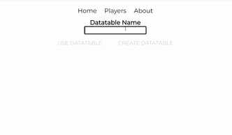
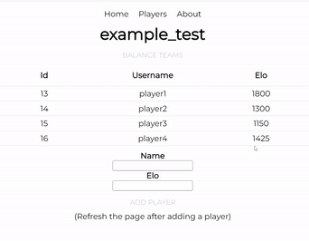

# TeamBalancer.com

This is a site that creates the most balanced teams consisiting of players of your chosing.

## How it Works

When you first enter the site, you can navigate to the players tab to create a datatable. You can then populate this datatable with players that you are playing with or will possibly have to balance in the future. You'll have to give each player their own base rating to start them off. 

<!--  -->
  

  
If you want to start the team creation process, you can click on the players and their row will be highlighted, indicating that they are selected. When at least 4 or more players are selected, you will be navigated to a new page that posts the top 5 most balanced teams possible with this combination of selected players. Whichever pair of teams you choose to use, you can input which team wins after. This will adjust the elo's of the selected players, as those who won will gain elo, and those who lost will lose elo.

<!--  -->
  

The datatable will remember the players and their respective ratings. In order to use the same datatable of players in the future, you'll just have to remember the datatable name to log back into it through the "Use Datatable" button.

## Misc

[Trials And Tribulations](https://docs.google.com/document/d/1hRozL_OkqxYO7jzum2diKk75hJsUligB3bX_KgUM7w8/edit?usp=sharingm)

